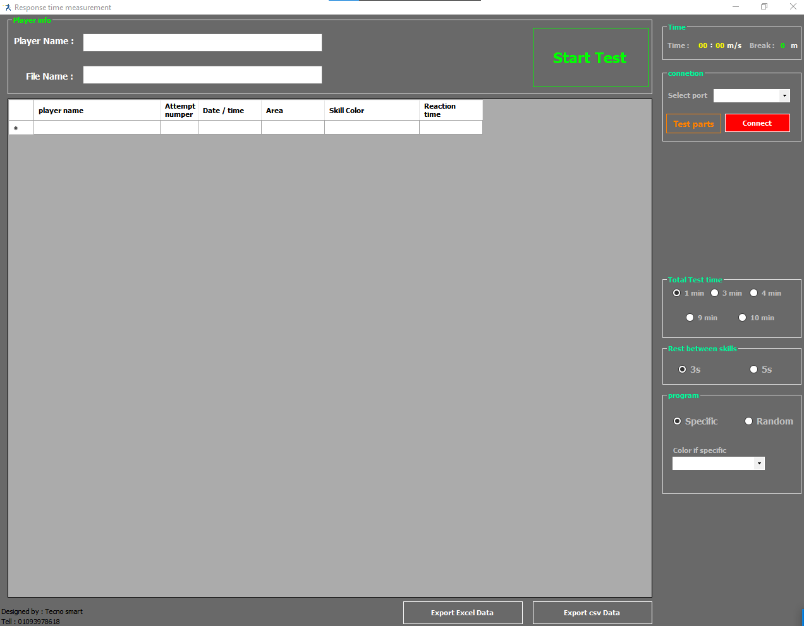
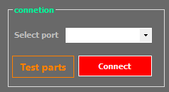
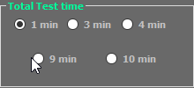
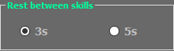
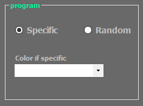
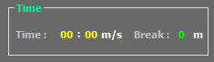
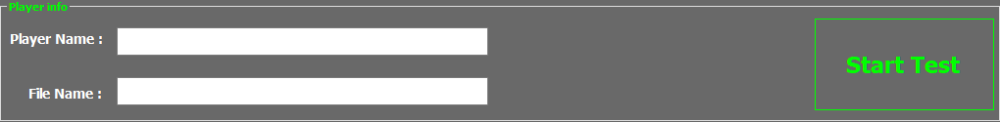
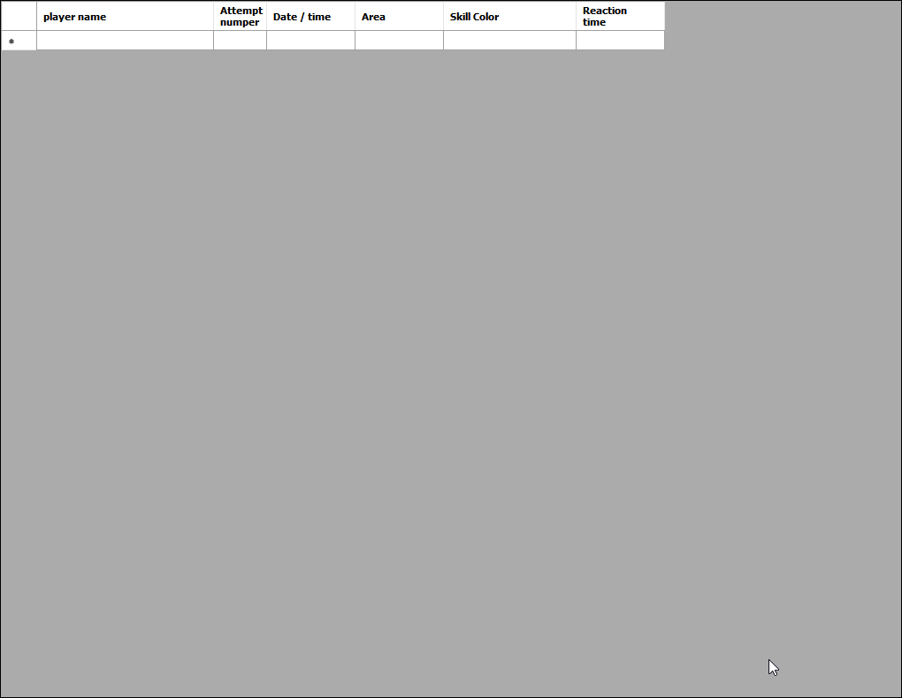

# tecno smart

## programing & seulution services
**Response time messurent App**
# How to use app
**** 
***main screen***

- connect usb to device and select Device port and click connect

- select time 

- select rest time between skills to redy for it

- How to use app ther are to mode to use it 
1. **specific** to select color of skill & random area
2. **Random**  Random skill & random area

- select rest time between skills to redy for it

- fill name and file name data   and click **start**

- **data area** this data table show all test data 

****
- finaly after finsh test there are two way to save data  
1. save as ***excel*** sheet
2. save as ***csv*** file

******
 [tell:+2 010 9397 8618]()
 [whats app:+2 012 0278 6234]()

